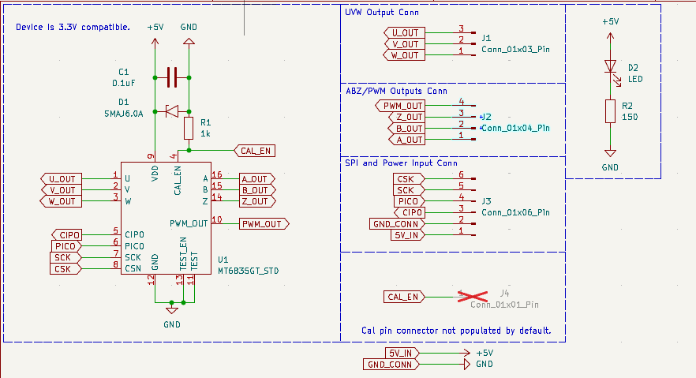

# MT6835_encoder_breakout_board
A simple breakout board for using the MT6835 magnetic encoder. 

## How to use the board
See [schematic](./magnetic_encoder_schematic.pdf) for more details
### Inputs/Outputs
The connections are broken out into 3 JST-PH connectors
  - 6 pin: SPI and power input (mandatory- need 3.3 or 5V to power board)
  - 4 pin: ABZ/PWM output
  - 3 pin: UVW output

The thinking being you will need to connect via SPI to configure the encoder no matter what, but likely you'll use either ABZ or UVW for monitoring position.

## How to order 
The BOM for this design was optimized around in-stock JLCPCB parts. To order this board, simply make a zip of the "JLCPCB" folder and upload to the JLCPCB order page.

## Schematic

